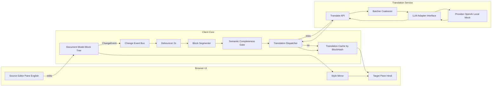
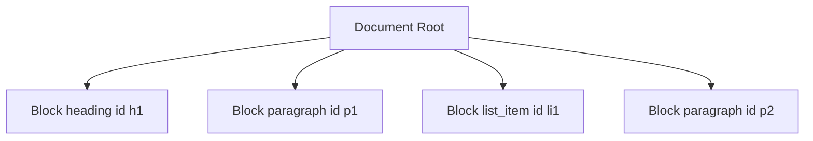
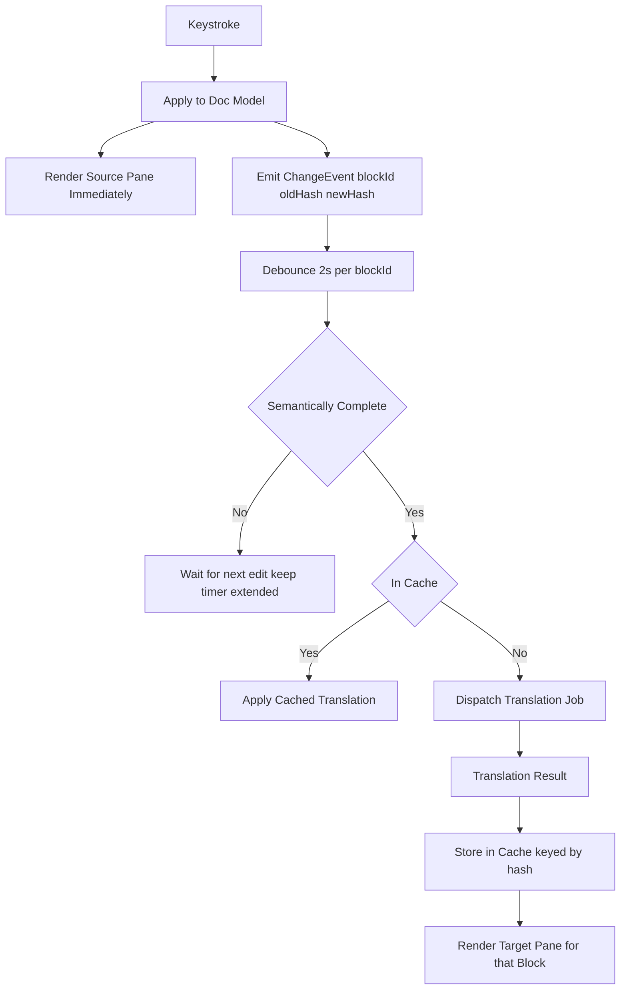

## What we will do

We are building a **side-by-side document experience**. On the left, the user edits a rich document in **English** (text plus formatting such as bold, headings, and lists). On the right, they see the **same layout and styling**, but the **words are Hindi**, produced by a **large language model (LLM)** when it is appropriate to translate.

**Feel and speed:** Typing and formatting on the left must stay **instant** and must **never wait** on the network or the model. Only the right-hand pane depends on translation. When the user pauses, we look at **small pieces of the document** (for example one paragraph or block at a time), not the whole file every time, so updates stay **cheap and local** in spirit.

**When we translate:** Translation is **triggered by the user’s edits**, not by constantly polling the whole document. After the user stops changing a given block for about **two seconds**, we consider sending that block for translation. Before we do, we run a **completeness check** so we do not waste calls on half-finished lines: simple rules first (punctuation, length, obvious “still typing” endings), and if needed a **smarter check** that compares the current text to what we had before (for example embeddings or a light “is this a full thought?” step). If the line still looks unfinished, we **wait** for more typing.

**Behind the scenes:** A small **translation service** talks to the LLM through a **single pluggable adapter** (so you can swap providers or use a mock in tests). We **cache** translations by the **exact source text** so unchanged paragraphs do not get re-translated. We handle **errors, retries, and overload** so a slow model does not break editing.

**How the document is organized:** We treat the document as a **tree of blocks** (paragraphs, headings, and so on), each with a **stable id** and its own **content hash**. That lets us know **what changed**, **what to translate**, and **when to ignore stale results** if the user kept typing after a request went out.

**What follows below:** The rest of this plan is the **structured design**—layers, diagrams, interfaces, and operational details—so engineers can implement the system in a **modular, testable** way without mixing UI, document state, translation policy, and LLM vendor code.


## 1. Design Approach (how we will proceed)

We will design the system in layers, top-down, so each layer has a single responsibility and a clean interface to the next. The layers are:

1. **Document Model** - language-agnostic representation of text + styling, addressable by stable block IDs.
2. **Editor UI** - side-by-side panes that render the same model; source is always editable; target is read-only and styling-mirrored by default, with optional editable Hindi (Section 4.1).
3. **Change Pipeline** - captures edits, debounces, segments, gates on semantic completeness, and dispatches translation jobs.
4. **Translation Service** - stateless block-level translator with caching, batching, and retry.
5. **LLM Adapter** - pluggable backend (OpenAI / local / mock) behind a single interface.
6. **State & Sync** - reconciles translated blocks back into the target pane without blocking the source.

Principles applied: separation of concerns; single responsibility; **dependency inversion** (depend on the `LLMAdapter` interface, not a concrete provider); command/event style for edits; a **light command–query split** (source edits update the document; the target pane primarily reads cached or in-flight translations—not full enterprise CQRS, but the same separation of concerns); and **idempotency** keyed by `blockId` and content hash so late or duplicate responses cannot corrupt the model.

## 2. High-Level Architecture

This section names major **layers** and **data flow** only. Words such as **block** and **inline styles** (`styles`) are defined precisely in **Section 3** before any further examples use them.

**Diagram legend (read once):** The boxes under **Browser UI** are self-explanatory panes plus **Style Mirror** (copies block structure and inline styles to the Hindi side). Under **Client Core**, **Document Model** is the block tree (Section 3). **Change Event Bus** collects edit notifications. **Debouncer** enforces quiet time (for example two seconds) per block before translation is considered. **Block Segmenter** maps events to translation units (usually one block). **Semantic Completeness Gate** decides whether text looks finished enough to send. **Translation Dispatcher** schedules work. **Translation Cache** holds results keyed by content hash. On the server, **Translate API** is the HTTP entry point; **Batcher** merges eligible blocks into fewer LLM calls; **LLM Adapter** is the pluggable backend. These labels are enough to follow the arrows; Section 3 defines **block**, hashes, and `translationMeta` in depth.



## 3. Document Model

The **document model** is the single source of truth for what the user sees and edits. Everything else—the source editor view, the Hindi mirror view, the debouncer, the translation cache—is either a **projection** of this model or **metadata** keyed off it. If the model is clear and stable, the rest of the system stays simple.

### 3.1 What problem it solves

Rich documents mix **structure** (headings, lists, tables), **inline presentation** (bold, links, font size), and **natural language** (the actual English). Translation only cares about **language-bearing text**, but the product must preserve **layout and styling** in the Hindi pane without asking the LLM to “guess” styles. The model therefore **separates**:

1. **What is translated** — a contiguous string of human language for one **translation unit** (defined below; by default one **block**, such as one paragraph).
2. **What is mirrored** — block structure and **inline formatting** (the per-run **`styles`** array—defined in Section 3.2.6) on the target side, copied from the source without LLM involvement.

Section **Section 3.2** defines each entity **in order** and gives a **tiny example** right after each definition. Sections **Section 3.4–Section 3.5** show larger fragments. Section **Section 3.6** is one **complete** document tree using several entities together, with a full walkthrough.

### 3.2 Core vocabulary (definition, then a tiny example)

Read this subsection once; each **Tiny example** is minimal on purpose. **Section 3.6** assembles the same ideas into one **complete** document.

#### 3.2.1 Document root

The **document root** is the top node of the tree. It does not hold paragraph text itself. It holds **document-level metadata** (for example title, `sourceLang` / `targetLang`, optional revision id) and an **ordered list of child blocks** in reading order.

**Tiny example (root only):** metadata plus an empty list of children (no blocks yet).

```json
{
  "type": "document",
  "schemaVersion": 1,
  "meta": { "title": "Untitled", "sourceLang": "en", "targetLang": "hi" },
  "children": []
}
```

#### 3.2.2 What is a block

A **block** is one **logical unit** of content in the document tree. Blocks are children of the **document root** (or, in advanced layouts, nested inside other structural containers—policy choice). Each block has a **`type`** that tells the editor how to render it and how translation should treat it.

**Common block `type` values** (illustrative list; products can extend):

| `type` | Purpose (one line) |
|--------|---------------------|
| `paragraph` | Body text; default translation unit. |
| `heading` | Section title; usually carries a **level** (1–6) in `structural`. |
| `list_item` | One entry in a list; may carry list kind and indent in `structural`. |
| `blockquote` | Quoted passage. |
| `code_block` | Monospace preformatted block; may carry language in `structural`. |
| `table_cell` | One cell; row/column in `structural` if you model tables as blocks. |

**Translation unit:** By default, **one block** is one unit we debounce, gate, and send to the translator (for example one `paragraph`). Splitting a paragraph in the UI creates **two blocks** with **two ids**.

**Block vs wrapped “line” in the UI:** One `paragraph` block can span many visual lines when the editor wraps text. That is still **one block**.

**Tiny example (one `paragraph` block):** one translation unit; other fields abbreviated with `…` until defined in later rows.

```json
{
  "id": "11111111-1111-4111-8111-111111111111",
  "type": "paragraph",
  "structural": {},
  "inline": [{ "kind": "text", "text": "Hello.", "styles": [] }],
  "translationMeta": { "state": "idle" }
}
```

#### 3.2.3 Structural fields (`structural`)

**`structural`** holds **block-level** settings: things that apply to the whole block, not to a substring. Examples: heading **level**, list **indent**, text **alignment**, code block **language**. This is how we record “this is a level-2 heading” without mixing that information into the character stream.

**Tiny example (`heading` + level):** the number `2` applies to the **whole** heading block, not to individual letters.

```json
{
  "id": "22222222-2222-4222-8222-222222222222",
  "type": "heading",
  "structural": { "level": 2 },
  "inline": [{ "kind": "text", "text": "Section title", "styles": [] }],
  "translationMeta": { "state": "idle" }
}
```

#### 3.2.4 Inline array (`inline`)

**`inline`** is an **ordered list** of pieces that make up the **body** of a text-bearing block. Most pieces are **inline text nodes** (next subsection). Some schemas also allow non-text inline nodes (hard break, footnote anchor—product-specific).

**Tiny example (two nodes in order):** the reader will see `Hi` immediately followed by ` there`—two runs, concatenated for display.

```json
"inline": [
  { "kind": "text", "text": "Hi", "styles": [] },
  { "kind": "text", "text": " there.", "styles": [] }
]
```

#### 3.2.5 Inline text node

An **inline text node** is one object of the form “a string of characters plus optional formatting.” In JSON-shaped pseudocode it always has `kind: "text"`, a `text` string, and an optional **`styles`** array (Section 3.2.6). **Several** inline text nodes in a row mean “show these character runs one after another,” with possibly different formatting on each run.

**Tiny example (single node, no inline styles yet):**

```json
{ "kind": "text", "text": "Plain run.", "styles": [] }
```

#### 3.2.6 Inline styles (`styles` array)

Each inline text node may carry a **`styles`** array (JSON field **`"styles"`**). Each entry is **one inline style** applied to that node’s entire `text` run: it says how those characters should look or behave (bold, link, etc.). Inline styles **do not** replace the block’s **`type`** (whether the block is a heading or a paragraph is still determined by **`type`** and **`structural`**—see Section 3.2.7).

Typical style entries (each object usually has at least `"type"` and optional `"attrs"`):

| Style `type` | Meaning |
|------|---------|
| `bold` | Heavier typeface for that run. |
| `italic` | Slanted typeface. |
| `underline` / `strike` | Underline or strikethrough. |
| `link` | Clickable; carries attributes such as `href`. |
| `code` | Monospace styling for a short run inside prose. |
| `textColor` / `highlight` | Colors. |

**Editor-library note:** ProseMirror and some other stacks call this concept **marks** in their own API. When binding to this architecture, map their character-level metadata into our **`styles`** array so the rest of the plan uses one vocabulary.

**Why inline styles exist:** If the user writes `See the docs for detail.` where **docs** is a hyperlink, we must remember **which letters** are linked when we substitute **Hindi** in the mirror pane. We split the paragraph into multiple inline text nodes; only the middle node’s **`styles`** array contains a **`link`** entry.

**What the LLM is given:** Usually a **single plain string** formed by concatenating all `text` fields in order. **Inline styles are not** sent as natural language; they stay in the tree for rendering.

**Tiny example (one word bold):** only the run `key` is bold.

```json
{ "kind": "text", "text": "key", "styles": [{ "type": "bold" }] }
```

#### 3.2.7 Inline styles vs block `type`

If the whole line is a heading, that is **`type: "heading"`** plus **`structural.level`**. That is **not** expressed by putting a “heading” entry inside **`styles`** on a substring. **Inline styles apply inside** the heading’s or paragraph’s text runs (bold, link, etc.).

**Tiny example (both ideas):** block `type` says “this whole block is a heading”; a **`bold`** entry in **`styles`** applies only to the word `Alert` (the prefix `Warning:` is plain text).

```json
{
  "id": "33333333-3333-4333-8333-333333333333",
  "type": "heading",
  "structural": { "level": 1 },
  "inline": [
    { "kind": "text", "text": "Warning: ", "styles": [] },
    { "kind": "text", "text": "Alert", "styles": [{ "type": "bold" }] },
    { "kind": "text", "text": " today.", "styles": [] }
  ],
  "translationMeta": { "state": "idle" }
}
```

#### 3.2.8 Block identity (`id`)

Each block has an **`id`**: a **stable identifier** (for example a UUID—a universally unique identifier) for that logical block. Scroll sync, per-block debounce, translation jobs, and “ignore stale LLM replies” all key off `id`.

**Stability rule:** **Keep** the same `id` while the user edits characters **inside** that block. **Allocate new ids** when the user **splits** one paragraph into two or **merges** two blocks—those are new logical units. **Merge and split semantics** (what happens to translation and the Hindi pane) are spelled out in **Section 3.9**.

**Tiny example (two siblings, two ids):** two paragraphs, two different `id` values.

```json
"children": [
  { "id": "aaaaaaaa-aaaa-4aaa-8aaa-aaaaaaaaaaaa", "type": "paragraph", "structural": {}, "inline": [{ "kind": "text", "text": "First.", "styles": [] }], "translationMeta": { "state": "idle" } },
  { "id": "bbbbbbbb-bbbb-4bbb-8bbb-bbbbbbbbbbbb", "type": "paragraph", "structural": {}, "inline": [{ "kind": "text", "text": "Second.", "styles": [] }], "translationMeta": { "state": "idle" } }
]
```

#### 3.2.9 Translation metadata (`translationMeta`)

**`translationMeta`** is per-block state used by the pipeline and UI: current **translation state**, timestamps, last error, optional **last completed** `sourceHash`, optional stored **Hindi** text for display until updated. It is **not** sent to the LLM as part of the source sentence; it is **control and cache display** data.

**Tiny example (`done` with cached Hindi):** `targetText` holds the last accepted translation for display until the source changes again.

```json
"translationMeta": {
  "state": "done",
  "sourceHash": "e3b0c44298fc1c149afbf4c8996fb92427ae41e4649b934ca495991b7852b855",
  "targetText": "नमस्ते।"
}
```

#### 3.2.10 Content fingerprint (`sourceHash`)

**`sourceHash`** (or equivalent) is a **hash of the canonical source text** for that block plus versioning inputs (languages, prompt/model version). It is used for **cache lookup** and **stale detection**. Section 3.7 gives the exact derivation rule.

**Tiny example (fingerprint only):** the hex string stands for “this exact English + policy inputs”; recomputing it after an edit tells you whether cache entries still apply.

```text
sourceHash = "7f83b1657ff1fc53b92dc18148a1d65dfc2d4b1fa3d677284addd200126d9069"
```

#### 3.2.11 Reference shape (after all names above)

- **Block** = `{ id, type, structural?, inline: InlineNode[], translationMeta }`
- **InlineNode** (text case) = `{ kind: "text", text: string, styles?: Style[] }` plus any other allowed `kind` values your product defines.

**Tiny example (shape checklist in one block):** every named field from Section 3.2.2–Section 3.2.9 appears once.

```json
{
  "id": "44444444-4444-4444-8444-444444444444",
  "type": "paragraph",
  "structural": {},
  "inline": [{ "kind": "text", "text": "Shape demo.", "styles": [] }],
  "translationMeta": { "state": "idle", "sourceHash": null, "targetText": null }
}
```

### 3.3 Tree shape (after vocabulary)

The document is a **tree**: one **root**, then an **ordered list of blocks**. Each block is one node in the diagram below; the labels assume you have already read Section 3.2.



**Reading the diagram:** **Root** is Section 3.2.1. Each child is a **block** (Section 3.2.2) with its own `id`. `heading`, `paragraph`, and `list_item` are **block `type`** values. The real document would also carry `structural`, `inline`, and `translationMeta` on each node; the diagram only shows structure.

### 3.4 Example A — plain text with multiple paragraphs

This example shows **only** `paragraph` blocks and **no inline styles** (every `styles` array is empty). It builds on Section 3.2.

#### 3.4.1 Input sample

```text
First paragraph has two lines
that are still one paragraph.

Second paragraph.

Third.
```

#### 3.4.2 Procedure (how we construct the tree)

1. **Split on blank lines:** Treat one or more consecutive newline-only lines as a **paragraph separator**. Each remaining non-empty chunk of lines is one **logical paragraph** string.
2. **Join lines inside one chunk:** For this product rule, replace single newlines **inside** a chunk with a **space** so the first chunk becomes one English sentence (still one **translation unit**).
3. **Materialize blocks:** For each string, create one **`paragraph` block** (Section 3.2.2) with a **new `id`** (Section 3.2.8). Put the whole string in **one** inline text node (Section 3.2.5) with **`styles: []`** (Section 3.2.6—no inline formatting).
4. **Attach to root:** Append those blocks in order to the root’s **`children`** (Section 3.2.1).
5. **Hashes later:** Compute **`sourceHash`** (Section 3.2.10, detail in Section 3.7) when the pipeline needs it; at import time it may be unset.

Strings after step 2:

1. `First paragraph has two lines that are still one paragraph.`
2. `Second paragraph.`
3. `Third.`

#### 3.4.3 Resulting JSON (conceptual)

```json
{
  "type": "document",
  "schemaVersion": 1,
  "meta": { "sourceLang": "en", "targetLang": "hi" },
  "children": [
    {
      "id": "a1b2c3d4-0001-4000-8000-000000000001",
      "type": "paragraph",
      "structural": {},
      "inline": [
        { "kind": "text", "text": "First paragraph has two lines that are still one paragraph.", "styles": [] }
      ],
      "translationMeta": { "state": "idle", "sourceHash": null, "targetText": null }
    },
    {
      "id": "a1b2c3d4-0002-4000-8000-000000000002",
      "type": "paragraph",
      "structural": {},
      "inline": [
        { "kind": "text", "text": "Second paragraph.", "styles": [] }
      ],
      "translationMeta": { "state": "idle", "sourceHash": null, "targetText": null }
    },
    {
      "id": "a1b2c3d4-0003-4000-8000-000000000003",
      "type": "paragraph",
      "structural": {},
      "inline": [
        { "kind": "text", "text": "Third.", "styles": [] }
      ],
      "translationMeta": { "state": "idle", "sourceHash": null, "targetText": null }
    }
  ]
}
```

#### 3.4.4 Walkthrough of Example A (tie JSON to definitions)

- The outer object is the **document root** (Section 3.2.1). `schemaVersion` supports migrations on save/load (Section 3.11). `meta.sourceLang` / `targetLang` are document-level hints for translation.
- **`children`** is the ordered list of **blocks** (Section 3.2.2). There are three blocks because the input had three non-empty paragraphs after splitting.
- Each child has **`type": "paragraph"`** so the UI renders body text.
- **`structural`** is empty `{}` because plain import did not assign heading level or alignment; those keys exist so the shape is uniform (Section 3.2.3).
- **`inline`** is a one-element array because the whole paragraph is plain text: one **inline text node** (Section 3.2.5) with all characters in `text`.
- **`styles": []`** means “no bold, link, or other inline formatting on this run” (Section 3.2.6).
- **`id`** differs per block so debouncing and translation can target **one** paragraph (Section 3.2.8).
- **`translationMeta.state": "idle"`** means the translation pipeline has not scheduled work yet (full state list in Section 3.8). `sourceHash` / `targetText` are `null` until the app fills them.

**Import edge cases** (same rules everywhere): trim leading/trailing blank lines; collapse multiple blank lines between paragraphs to one separator; a very long single paragraph stays **one block** until the user splits it in the editor.

### 3.5 Example B — one paragraph with a link (inline `styles` in use)

#### 3.5.1 Intent in English

The user sees one sentence: **See the** **docs** **for detail.** — where the word **docs** is a hyperlink. We need three **inline text nodes**: plain, linked, plain.

#### 3.5.2 JSON for that single `paragraph` block

```json
{
  "id": "b2c3d4e5-1001-4000-8000-000000000099",
  "type": "paragraph",
  "structural": {},
  "inline": [
    { "kind": "text", "text": "See the ", "styles": [] },
    {
      "kind": "text",
      "text": "docs",
      "styles": [{ "type": "link", "attrs": { "href": "https://example.com" } }]
    },
    { "kind": "text", "text": " for detail.", "styles": [] }
  ],
  "translationMeta": { "state": "idle", "sourceHash": null, "targetText": null }
}
```

#### 3.5.3 Walkthrough of Example B

- Still one **`paragraph` block** (Section 3.2.2): one translation unit, one `id`.
- **`inline`** has **three** objects because formatting changes twice (Section 3.2.4–Section 3.2.5).
- First and third nodes have **`styles": []`**: ordinary English (Section 3.2.6).
- The middle node’s **`styles`** array contains one **`link`** style entry with **`attrs.href`**: only the letters `docs` are clickable (Section 3.2.6).
- **String sent to the LLM** (Section 3.2.6): concatenate `text` → `See the docs for detail.` — the model does not need the URL to translate the word “docs” unless you choose to add it in the prompt.
- **Hindi mirror (conceptually):** the UI applies the **same three-node structure** and the **same `link` style** on the middle run; only the middle `text` becomes Hindi. Inline styles were never “translated,” only **preserved** (Section 4).

### 3.6 Example C — complete mini document (all entities together)

This example is a **whole tree**: **document root** (Section 3.2.1), several **blocks** with different **`type`** and **`structural`** (Section 3.2.2–Section 3.2.3), **`inline`** runs and **`styles`** (Section 3.2.4–Section 3.2.6), distinct **`id`s** (Section 3.2.8), and **`translationMeta`** (Section 3.2.9). **`sourceHash`** may be filled later (Section 3.2.10, Section 3.7).

#### 3.6.1 User-visible intent (English)

The user sees, in order:

1. A **level-1 heading:** `Notebook`
2. A **bullet list item:** `Capture ideas.`
3. A **paragraph** where the word **`important`** is **bold:** `Ship the important draft today.`
4. A **plain paragraph:** `We will refine later.`

#### 3.6.2 Complete JSON tree

```json
{
  "type": "document",
  "schemaVersion": 1,
  "meta": { "sourceLang": "en", "targetLang": "hi" },
  "children": [
    {
      "id": "d1111111-1111-4111-8111-111111111111",
      "type": "heading",
      "structural": { "level": 1 },
      "inline": [
        { "kind": "text", "text": "Notebook", "styles": [] }
      ],
      "translationMeta": { "state": "idle", "sourceHash": null, "targetText": null }
    },
    {
      "id": "d2222222-2222-4222-8222-222222222222",
      "type": "list_item",
      "structural": { "kind": "bullet", "indent": 0 },
      "inline": [
        { "kind": "text", "text": "Capture ideas.", "styles": [] }
      ],
      "translationMeta": { "state": "idle", "sourceHash": null, "targetText": null }
    },
    {
      "id": "d3333333-3333-4333-8333-333333333333",
      "type": "paragraph",
      "structural": {},
      "inline": [
        { "kind": "text", "text": "Ship the ", "styles": [] },
        { "kind": "text", "text": "important", "styles": [{ "type": "bold" }] },
        { "kind": "text", "text": " draft today.", "styles": [] }
      ],
      "translationMeta": { "state": "idle", "sourceHash": null, "targetText": null }
    },
    {
      "id": "d4444444-4444-4444-8444-444444444444",
      "type": "paragraph",
      "structural": {},
      "inline": [
        { "kind": "text", "text": "We will refine later.", "styles": [] }
      ],
      "translationMeta": { "state": "idle", "sourceHash": null, "targetText": null }
    }
  ]
}
```

#### 3.6.3 Walkthrough of Example C (map every part)

- **Root** (`type: "document"`, `schemaVersion`, `meta`): same role as Section 3.2.1 tiny example, but `children` is now populated. `meta.sourceLang` / `targetLang` apply to the whole file.
- **Child 0 — heading:** `type: "heading"` (Section 3.2.2). `structural.level: 1` (Section 3.2.3) says “top-level heading,” not an inline style on a substring. `inline` is one text node (Section 3.2.5); `styles` empty (Section 3.2.6). Its own `id` is one **translation unit**.
- **Child 1 — list item:** `type: "list_item"` (Section 3.2.2). `structural.kind` / `indent` (Section 3.2.3) describe list presentation for the **whole** row. Body text lives in `inline` like any other block.
- **Child 2 — paragraph with bold:** `type: "paragraph"`. **`inline` has three nodes** (Section 3.2.4): plain, bold, plain. Only the middle node carries **`styles: [{ "type": "bold" }]`** (Section 3.2.6). **LLM plain string** for this block is the concatenation `Ship the important draft today.` (Section 3.7).
- **Child 3 — plain paragraph:** one inline node, empty `styles`; another **translation unit** with its own `id`.
- **Why four `id`s:** Four logical blocks ⇒ four debouncers, four cache lines, four scroll anchors (Section 3.2.8).
- **`translationMeta`:** All `idle` here; real sessions move individual blocks through `pending` / `translating` / `done` independently (Section 3.8).

### 3.7 Deriving “text for the LLM” and `sourceHash`

**Canonical plain string:** Concatenate every `inline` node’s `text` where `kind === "text"`, in array order, using a fixed rule for any non-text nodes (for example represent a hard break as `\n` or as a space—pick one and document it).

**Hash:** For example `sourceHash = SHA256(canonicalSourceText + sourceLang + targetLang + promptVersion)` (include `modelVersion` if it changes output). Include **structural** keys in the hash only when they change translation policy (same English as `paragraph` vs `heading` may deserve different Hindi). `promptVersion` avoids cache collisions after instruction changes.

### 3.8 Translation state on the block

Per-block **`translationMeta.state`** (names may vary by implementation):

- **`idle`** — no pending work; displayed Hindi matches current hash, or there is no Hindi yet (per UX policy).
- **`pending`** — debounce satisfied; completeness gate may still hold.
- **`translating`** — request in flight for this `id` and a specific source snapshot.
- **`done`** — stored Hindi matches current content hash.
- **`stale`** — source changed after a request went out; wait for superseding result or show interim UI.
- **`error`** — last attempt failed; offer retry; source editing still works.

States are **per block**: one paragraph can be `error` while others stay `done`.

### 3.9 Block identity: stable `id`, merge, and split

#### 3.9.1 Stable `id` (summary)

**Keep** the same `id` for in-place character edits **inside** one block (typing, deleting characters, toggling **inline `styles`**). After a **merge** or **split**, the set of translation units changes: allocate **new** `id`s for each **new** unit unless you implement the stricter invalidation rules in **Section 3.9.4** (reuse is possible but error-prone). Without a clear rule, debouncing, scroll sync, and stale-response dropping break.

#### 3.9.2 Merging two paragraphs into one

**What the user does:** Typical case is placing the caret at the **start** of the second paragraph and pressing **Backspace** (or an equivalent “join with previous” gesture), so the boundary between two blocks disappears and the text reads as one continuous paragraph.

**What the document model does:**

1. **Replace two blocks with one** in the root’s `children` list (reading order preserved). The merged block’s **`inline`** array is built by **concatenating** the two blocks’ inline sequences, with an explicit **join policy** at the seam—for example insert a single space text node between them if both sides are plain text, or merge adjacent text nodes when **`styles`** match on both sides of the boundary so you do not duplicate runs unnecessarily.

2. **`id` for the merged block (recommended policy): allocate a new UUID.** Do **not** keep only the first paragraph’s `id` while silently dropping the second: clients would still associate the old Hindi for that `id` with **shorter** English, which is wrong once the paragraph has grown. A **fresh `id`** means “this is a new translation unit,” so the UI and cache do not inherit a false sense of `done`.

3. **Cancel work keyed to the old ids:** Stop debounce timers, drop in-flight translation jobs, and **ignore** any late LLM responses tagged with **`blockId`** equal to either removed id.

4. **Translation metadata on the merged block:** Reset **`translationMeta`** for the new block to a safe baseline (for example `state: idle`, `targetText: null`, `sourceHash: null` until recomputed). Optionally show a short **“merged—translating…”** state on that row only.

5. **Hindi pane:** Remove the **second** block’s mirrored row entirely. The **merged** row shows either **source English dimmed** until a new Hindi result arrives, or a **product-chosen** interim string (for example concatenation of the two old Hindi strings with a space—usually **low quality** and not recommended unless labeled as temporary).

6. **Cache:** Old cache entries keyed by **hash of former paragraph A** or **former paragraph B** do **not** apply to the merged English string. The merged block gets a **new** `sourceHash` after content settles; treat as a cache miss.

7. **Binding / events:** Emit an explicit **`BlockMerged`** (or equivalent) change event carrying **`removedIds: [idA, idB]`**, **`newBlockId`**, and optionally a **snapshot** for undo. The change pipeline (Section 5) subscribes so it does not leave orphan timers for removed ids.

8. **Undo:** Restore **two** blocks; each should get back its **original `id`** if your undo stack stores ids, or new ids if you treat undo as forward operations—pick one scheme and stay consistent with scroll and cache.

**Alternative (not recommended):** Retain the **upper** paragraph’s `id` and only delete the lower block. If you do this, you **must** immediately force **`translationMeta`** to **`stale`/`idle`**, clear **`targetText`**, and retranslate—otherwise the Hindi pane will show text that only matched the **old** first paragraph.

#### 3.9.3 Splitting one paragraph into two (brief)

The inverse operation: **one** block becomes **two** sibling blocks, each with a **new `id`** (or restore known ids on undo). **Concatenate** inline at the split point into tail of first block and head of second. Cancel in-flight work for the **original** id; neither new block inherits the old Hindi without retranslation.

#### 3.9.4 Why we prefer a **new** `id` after merge (and when reusing is still allowed)

**Clarification:** We **do** reuse an `id` whenever the user is still editing **the same** logical paragraph. The question is only about **structural** events (merge/split), where the paragraph boundaries change.

**Reasons a fresh `id` for the merged block is the default recommendation:**

1. **Wrong Hindi if you “keep the first id” silently:** `translationMeta.targetText` and cache entries were produced for **old** English (e.g. only paragraph A). After merge, the English is **A + B**. Showing the old Hindi next to the longer English is **incorrect** until retranslated. A new `id` forces every consumer to treat the row as a **new** unit with no inherited `done` state.

2. **Late LLM responses:** A response may still carry **`blockId`** of a paragraph that existed when the request was sent. If you **deleted** that id on merge, the client drops the response trivially (“unknown id”). If you **reused** the first paragraph’s id for merged text, a response for the **pre-merge** short string can still arrive and, without perfect versioning, could be applied to **post-merge** longer text.

3. **Fewer special cases:** With a new `id`, scroll-sync tables, debouncers, and metrics keyed by `blockId` do not need a one-off “merge invalidated this id” branch on every code path. The merge event already maps **old ids → new id**.

4. **`sourceHash` / cache:** The merged string never matched the old per-paragraph hashes. A new `id` matches the mental model: **new unit, new hash line**.

**When reusing an `id` is still defensible:** Some products keep the **upper** paragraph’s `id` so one scroll anchor stays stable. That can work **only if** you (a) **cancel** all work for both old ids, (b) **clear** Hindi and reset state for the surviving id as aggressively as for a new block, and (c) attach a **monotonic revision** or **content generation** to every request/response so anything older than the merge is discarded. A **new `id`** achieves the same safety with **less** coupling between merge handling and every network callback.

**Bottom line:** Not reusing is not a law of nature; it is a **default** that minimizes stale UI and bad applies. If you reuse, you are trading a new UUID for **strict** invalidation and versioning discipline everywhere.

**Relation to “before / after” diff:** Churning **`id`s** on merge/split does **not** block document comparison; use **snapshots**, **matching**, and optional **lineage** or **`anchorId`** as in **Section 3.13**—do not rely on `id` alone to align two revisions.

### 3.10 Mapping to the editor (binding layer)

The rich-text editor (Lexical, ProseMirror, Slate, etc.) has **its own** native tree. Avoid two divergent truths: either the **editor model is canonical** and you project to blocks and hashes, or **this document model is canonical** and the editor is a view. The binding layer emits **`ChangeEvent`s** with stable **`id`**s (see change pipeline).

### 3.11 Persistence and round-trip

Serialize **`id`**, **`type`**, **`structural`**, **`inline`** (including per-run **`styles`**), and optionally cached Hindi. Carry a **`schemaVersion`** for migrations.

### 3.12 Library note

Slate.js, ProseMirror, and Lexical support hierarchical documents and **per-character / per-run styling** (their APIs may still call these **marks**). **Which** editor nodes become which **block types** (Section 3.2.2) is a **product** decision—for example whether each table cell is its own translation unit.

### 3.13 Comparing two document trees (before / after) when many `id`s change

**Goal:** Show a **structural or visual diff** between revision A (before) and revision B (after)—for example after a large edit, a merge, or an import—without assuming that the same paragraph keeps the same **`id`**.

**Core idea:** **Do not key revision-to-revision comparison only on `id`.** The live **`id`** exists for translation, debounce, and stale suppression (Section 3.2.8, Section 3.9). **Diff** is a separate concern: you **match** blocks between two **snapshots**, then compute per-block or per-inline changes.

**How to proceed:**

1. **Persist immutable snapshots**  
   Store each revision as a **full serialized tree** (or a patch against a base) with its own **`revisionId`** and timestamp. Comparison is always **`snapshotA` vs `snapshotB`**, not “mutate in place and hope ids line up.”

2. **Block matching (pair old blocks to new blocks)**  
   Build a **many-to-many or one-to-one mapping** between blocks in A and blocks in B using a **stacked strategy** (try earlier steps first, fall back to later ones):

   - **Same `id` present in both snapshots** — treat as the **same** logical block if `id` exists in A and B (typical for in-place typing without merge/split).
   - **Explicit lineage from structural ops** — when you emit **`BlockMerged`** / **`BlockSplit`** (Section 3.9), the **history layer** can record `newBlockId` → `{ formerIds: [...] }` (and the inverse on split). The diff engine uses that as **ground truth** for “this paragraph absorbed those two.”
   - **Structural position** — match by **reading order index** plus **`type`** and **`structural`** (e.g. “third `paragraph` under root”) when ids differ but the tree shape is similar.
   - **Content similarity** — for unmatched paragraphs, score pairs by **normalized plain text** (Levenshtein ratio, longest common subsequence length, or embedding cosine similarity) and accept matches above a threshold; treat unmatched B-only as **insert**, A-only as **delete**. This handles **new UUIDs** after merge when you did not store lineage.
   - **Move detection (optional)** — if the same canonical text (or very high similarity) appears at different indices, classify as **move** rather than delete+insert.

3. **Inline diff inside matched blocks**  
   Once two blocks are paired, flatten each to a **plain string** (Section 3.7) or compare **`inline`** runs with a **sequence diff** on `(text, styles)` tuples so bold/link boundaries show correctly in the diff UI.

4. **Optional second identifier: `anchorId` or `semanticId`**  
   If the product needs **stable anchors across merges** (e.g. legal redlines tied to “clause 3” forever), introduce a **separate** field from the operational **`id`**: an **`anchorId`** (or similar) that **survives** until the user explicitly deletes that clause, while **`id`** may still rotate on merge/split for translation safety. **Do not** overload **`id`** to mean both “live translation row” and “permanent legal anchor” unless you accept the complexity of never rotating it.

5. **Why this coexists with “new `id` on merge”**  
   New **`id`s** keep the **live editor and translator** simple. The **diff / revision** layer adds **matching logic** (and optional **lineage** or **anchorId**) so “before vs after” stays meaningful **without** forcing operational ids to stay stable across structural edits.

## 4. Side-by-Side UI

So far this plan has defined **structure and language-bearing text** (Section 3) and **how to diff two trees** when block ids churn (Section 3.13). This section is about **presentation**: two panes bound to the same block ids, scroll alignment without pixel coupling, and—when the product enables it—editable Hindi with reverse sync (Section 4.1).

- Left pane: full-featured rich text editor bound to the **English** side of the document model.
- Right pane: by default a **read-only** mirror that reuses the same block structure and **`styles`**, substituting **Hindi** text per block. If no translation is available yet, show source text dimmed with a per-block “translating…” indicator. **Bidirectional mode** (user may edit Hindi and push changes back to English) is described in **Section 4.1** and changes data shape, pipeline, and conflict rules.
- Scroll-sync by block ID, not by pixel, so font differences between English and Devanagari do not break alignment.
- Styling is mirrored on the forward path (English → Hindi display), not re-inferred from the LLM. **Reverse** updates (Hindi → English) need their own rules for how much structure is preserved (Section 4.1).

### 4.1 Bidirectional editing (editable Hindi; source must reflect it)

**Requirement:** The **generated Hindi** is editable, and edits should **update the English source** so both panes stay consistent with one **logical** document per `block.id`.

**Strategy — treat each block as one anchor, two authored surfaces:**

1. **Data model (per block)**  
   - Keep **English** body in **`inline`** (as today).  
   - Store **Hindi** not only as a disposable string: add **`targetInline`** (same shape as **`inline`**: ordered text runs with **`styles`**) so the right pane is a real editor surface, or store Hindi as structured runs derived from the last machine translation and then user-edited.  
   - Add **control flags**, for example: `lastEditedSide: 'source' | 'target' | null`, and/or separate dirty bits `sourceDirty`, `targetDirty`, plus a **monotonic `syncGeneration`** or **`contentEpoch`** per block so every async job can be stamped and dropped if stale.  
   - Optional: `targetProvenance: 'machine' | 'user'` to show whether Hindi differs from last auto-translation.

2. **Two symmetric pipelines (same machinery, opposite direction)**  
   - **Forward** (en → hi): unchanged in spirit—debounce on **source** edits, completeness gate, `LLMAdapter.translate({ sourceLang: 'en', targetLang: 'hi', ... })`, update **`targetInline`** and hashes.  
   - **Reverse** (hi → en): on **target** edits, same **debounce** and **completeness gate** (tuned for Hindi), then `LLMAdapter.translate({ sourceLang: 'hi', targetLang: 'en', ... })`. **Cache** keys include direction and both prompt versions so forward and reverse do not collide.  
   - Reuse one **adapter interface**; only the **language pair** and **prompt template** change.

3. **Applying reverse translation to the source (hard part)**  
   - **MVP / robust default:** Replace the block’s **canonical English plain string** from the model output, then **rebuild or simplify `inline`**: e.g. single plain run, or **strip** complex **`styles`** for that block until the user reapplies them—predictable, avoids silent wrong bold spans.  
   - **Richer:** Ask the model for **Markdown or a tiny JSON schema** and **parse** back into `inline` with **`styles`** (higher quality, more parsing risk).  
   - **Advanced:** Word- or phrase-level **alignment** between edited Hindi and new English to map **`styles`** across scripts—expensive; treat as a later phase.  
   - Document explicitly: **perfect bidirectional preservation of inline styles** is not guaranteed in v1.

4. **Conflicts (both sides edited before sync finishes)**  
   Per **`block.id`**, serialize meaning: **one in-flight forward and one in-flight reverse** at most, or **cancel** the opposite direction when a new edit arrives on either side (policy pick one). Options:  
   - **Last edit wins** on the side that fired most recently, with a small UI notice when the other side’s pending result is dropped.  
   - **Queue**: apply forward then reverse (or vice versa) in order—can feel laggy.  
   - **Short lock**: while either job runs, disable the other pane for **that block only**—simplest for correctness.

5. **Stale supersede (bidirectional)**  
   Every job carries **`blockId` + `sourceHash` + `targetHash`** (or epoch). When applying a result, **all three** must still match the block’s current state; otherwise discard (same idea as forward-only stale drop).

6. **UI**  
   - Right pane uses the same block list; each row is an **editor** bound to **`targetInline`**.  
   - Show pending state on **whichever** side is waiting for the model (source waiting for hi, or target waiting for en).  
   - Optional: “**Sync from…**” or diff preview before applying destructive English replacement.

```mermaid
flowchart LR
    subgraph Block[block id stable]
        Src[English inline]
        Tgt[Hindi targetInline]
    end

    Src --|"edit debounce forward"| Fwd[Forward job en to hi]
    Fwd --> Tgt

    Tgt --|"edit debounce reverse"| Rev[Reverse job hi to en]
    Rev --> Src
```

7. **Relation to merge/split and diff**  
   Structural ops (**Section 3.9**) still emit explicit events; **`targetInline`** is merged/split in parallel with **`inline`**. Revision diff (**Section 3.13**) should treat **both** surfaces as part of the snapshot if you persist “full bilingual” documents.

**Summary:** The **`id`** still ties the row; you store **both** languages in the block, run **two** debounced translation pipelines (opposite directions), pick **clear conflict and stale rules**, and accept a **phased** strategy for how much **English structure** you restore after Hindi edits.

## 5. Change Pipeline (low latency + debounce + completeness gate)

The diagram below is a **walkthrough** of the same behavior summarized in the bullets that follow it. **Keystroke** means any edit applied to the document model; **ChangeEvent** carries `blockId` and hash snapshots so debouncing and stale detection stay per block. **Semantically Complete** is the completeness gate (Section 6). **Cache** is the client-side translation cache keyed by content hash (Section 7 ties this to the server).



Key points:
- **Immediate local refresh**: the source pane never waits for translation. Only the target pane's changed block shows a pending state. This satisfies the "very low latency, refresh with local content" requirement.
- **Per-block debounce**: 2 seconds of inactivity on a specific block before dispatch. Editing another block resets only that other block's timer.
- **Semantic completeness gate**: before dispatching, a lightweight local heuristic decides if the block is "sentence-shaped." If it is likely mid-thought, we keep waiting. Section 6 defines the two-stage gate.
- **Stale supersede**: if a new edit arrives while a translation is in flight for the same block, the in-flight result is discarded (by comparing `hash` at apply time).
- **Merge and split**: structural joins or splits emit explicit events (see **Section 3.9**). The dispatcher **cancels** timers and in-flight jobs for **removed** `blockId`s so merged text is never paired with Hindi that belonged only to the old first paragraph.
- **Bidirectional mode (Section 4.1):** Maintain a **reverse** path (Hindi edit → debounce → reverse translate → update English `inline`) with the same stale-supersede pattern using **`sourceHash` + `targetHash`** (or epoch). **Cancel or serialize** against the forward path per block so two jobs do not clobber each other without a defined order.

## 6. Semantic Completeness Gate

Section 5 placed a **completeness** decision in the pipeline before dispatch. Here we spell out what “complete enough to translate” means: avoid **mid-sentence garbage** and obvious work-in-progress using a two-stage **cheap-then-smart** check. **Stage A** runs on every candidate block; **Stage B** runs only when Stage A is ambiguous or you want extra safety. Both can start as **client-only** logic; the gate stays behind one interface so heuristics can evolve without rewriting the pipeline.

**Stage A - local heuristics (free, instant):**
- Block ends with terminal punctuation `. ! ? | ।` or is a complete list item / heading.
- Minimum token count (e.g. >= 3 tokens) and balanced quotes/brackets.
- Not ending in an open connective ("and", "but", ",", "-").

If Stage A passes, dispatch.

**Stage B - semantic delta check (only when Stage A is ambiguous):**
As the user specified, we can probe meaning by comparing the current edited block against the previous committed version of the same block:
- Compute embedding of `current_text` and `previous_text`.
- If cosine similarity is very high the user is still polishing - wait.
- If similarity is very low AND Stage A still fails the content is likely mid-construction - wait.
- Optionally call a tiny local model (or a cheap LLM endpoint) with prompt "Is this a complete thought? yes/no" as a fallback. This is opt-in because it adds latency/cost.

The gate is a pluggable interface so we can swap heuristics without touching the pipeline:

```
interface CompletenessGate {
  shouldTranslate(block: Block, previous: Block | null): Decision
}
```

## 7. Translation Service and LLM Adapter

After the client pipeline commits to a translation (Sections 5–6), this layer owns **network shape**, **batching**, **caching**, and **provider choice**. The same `LLMAdapter` interface should work for hosted APIs, a local runtime, or tests.

Server-side (or a local worker) exposes a single **`POST /translate`** endpoint in the sketch below (HTTP `POST` submits a request body to create or act on a resource).

```
POST /translate
{ blockId, sourceLang, targetLang, text, context?: { previousBlockText, nextBlockText } }
-> { blockId, translation, modelVersion, latencyMs }
```

Features:
- **Batching/coalescing**: if several blocks become eligible within a short window, batch them into one LLM call to reduce round-trips.
- **Context window**: include neighboring blocks as context-only (not to be translated) so Hindi output is coherent across blocks.
- **Caching**: server-side cache keyed by **SHA-256** (Secure Hash Algorithm 256-bit) over `text + sourceLang + targetLang + modelVersion`; client-side **LRU** (least-recently-used) eviction cache keyed the same way so memory stays bounded. Reopening a document whose blocks are unchanged should cost **zero** new LLM calls on cache hit.
- **Adapter pattern**: `LLMAdapter` interface with implementations `OpenAIAdapter`, `LocalLlamaAdapter`, `MockAdapter` (for tests). Dependency-injected.
- **Streaming (optional v2)**: stream tokens back so the target block fills progressively.

## 8. Robustness

The service sketch in Section 7 must still behave when the network or model is slow, flaky, or offline. This section lists **cross-cutting** behaviors that apply to both forward and bidirectional paths.

- **Idempotency**: every translation job carries `blockId + sourceHash`. Results older than the current `sourceHash` are dropped.
- **Backpressure**: a bounded in-flight queue per client; excess jobs are dropped in favor of the latest hash per blockId.
- **Retry with jitter** on transient LLM failures; after N retries the block is marked `error` in the target pane with a retry affordance.
- **Offline mode**: if the LLM is unreachable, target pane shows last-known translation plus a banner. Source editing never blocks.
- **Observability**: structured logs for each job (blockId, decision, gate outcome, cache hit, latency). Basic metrics: translations per minute, cache hit rate, gate rejection rate, and **p95** end-to-end latency (95th percentile: the slowest 5% of requests are slower than this threshold).

## 9. Core Interfaces (sketch, language-agnostic)

The types below are **names for contracts**; they assume the **Block** and inline **`styles`** vocabulary from Section 3. They are language-agnostic so the client and server can share terminology regardless of stack.

```
// Matches Section 3: blocks carry inline nodes; each text node has optional per-run styles (JSON field "styles").
type Block = { id, type, structural?, inline: InlineNode[], translationMeta }
type InlineNode = { kind: "text", text: string, styles?: Style[] } | /* other kinds per product */

interface DocumentModel {
  applyEdit(edit): ChangeEvent
  getBlock(id): Block
  onChange(listener)
}

interface CompletenessGate {
  shouldTranslate(current, previous): 'translate' | 'wait'
}

interface TranslationDispatcher {
  schedule(blockId)
  cancel(blockId)
}

interface TranslationCache {
  get(hash): Translation | null
  set(hash, translation)
}

interface LLMAdapter {
  translate(req): Promise<TranslationResult>
}
```

## 10. Deliverables of this design phase

With Sections 1–9 in place, the remaining work is **execution planning** (concrete stacks and milestones) and resolving the open decisions in Section 11.

- This architectural plan (saved).
- A follow-up implementation plan that picks concrete tech (e.g. React + Lexical on the client, FastAPI/Node on the server, OpenAI or local Llama as first LLM adapter).
- A minimal vertical slice milestone: single-paragraph English pane, single-paragraph Hindi pane, mock LLM, debounced pipeline, block-level cache. This proves the architecture before expanding to styling, tables, and streaming.

## 11. Open Questions (to answer before implementation)

- Preferred client stack (React + Lexical / ProseMirror / Slate)?
- Preferred LLM provider for v1 (hosted API vs local model)?
- **Bidirectional editing (Section 4.1):** If Hindi is editable, choose **conflict policy** (last-write-wins, queue, or per-block lock) and **how aggressively** to restore English **`styles`** after reverse translate (plain-text MVP vs structured parse vs alignment).
- Expected document size range (affects batching and virtualization strategy)?
